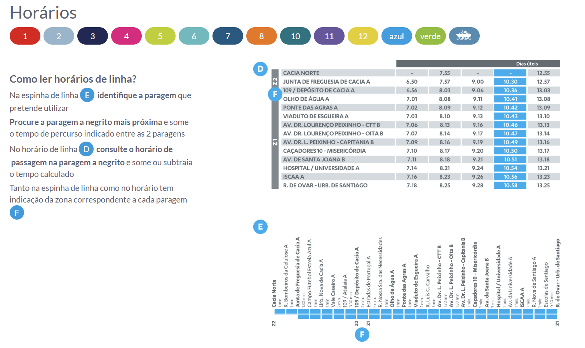
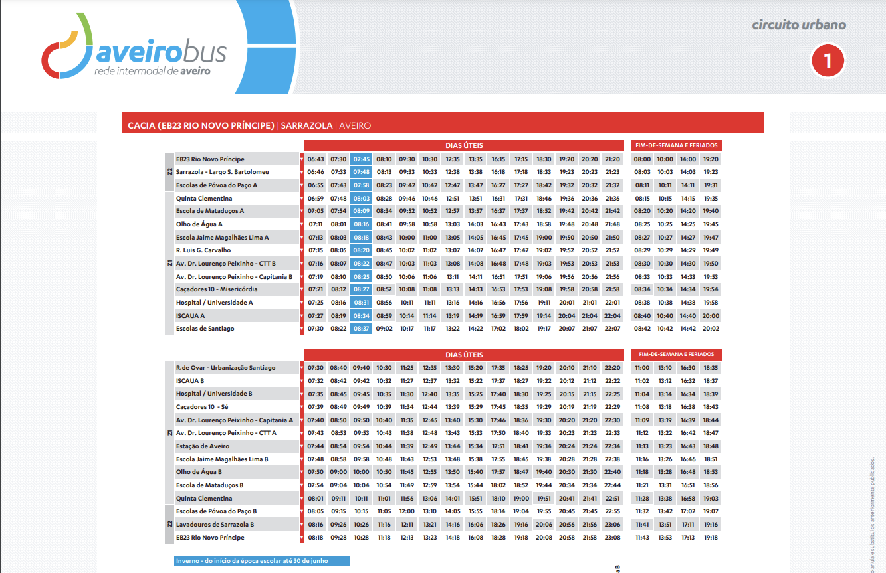

# Competitor Analysis: AveiroBus
## General Information 
- **Name of System:** AveiroBus
- **Company/Developer:** Camâra de Aveiro
- **Website/Product Page:** (https://www.aveirobus.pt) 
- **Version/Release Date:** n/a
- **Platform(s) Supported:** Web 
- **Target Audience:** Utilizadores de trasportes públicos em Aveiro

--- 
## Core Functionality 

**Primary Purpose:** - O sistema é utilizado para obter informções acerca dos autocarros públicos e outros transportes em Aveiro.

**Key Features:** - n/a

**Unique Selling Points (USPs):** - Os transportes disponibilizados pela companhia.

**Limitations/Weaknesses:** - Dificuldade na procura de horários.

---

## Screenshots

## Online Reviews

Inês - Os horários que estão no website não correspondem aos horários que estão nas paragens e os autocarros estão sempre atrasados.

