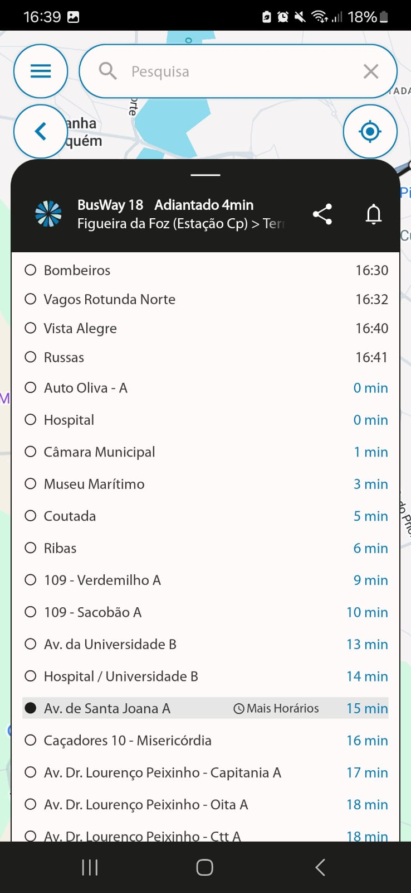
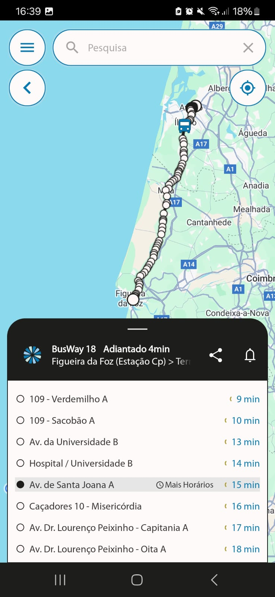

# Competitor Analysis: BusWay
## General Information 
- **Name of System:** BusWay 
- **Company/Developer:** Grupo Afifi
- **Website/Product Page:** (https://busway-cira.pt) 
- **Version/Release Date:** n/a
- **Platform(s) Supported:** Web, Mobile (iOS/Android) 
- **Target Audience:** Utilizadores de trasportes públicos em Aveiro

--- 
## Core Functionality 

**Primary Purpose:** - O sistema é utilizado para obter informções acerca dos autocarros da BusWay.

**Key Features:** - Organizada - Concisa - *Completa*

**Unique Selling Points (USPs):** - Organização da rede destaca-se da AveiroBus pela simplicidade da utlização da app. Posição real-time do transporte.  

**Limitations/Weaknesses:** - Não é possível fazer renovação online. Estado fisíco dos Autocarros.

---

## Screenshots

## Online Reviews

Carlos - Péssimo! Muita demora para uma simples recarga de passe social. Infelizmente não posso dar zero. Não há maneira de fazer a recarga pela internet, evitando assim esses contra tempos!

